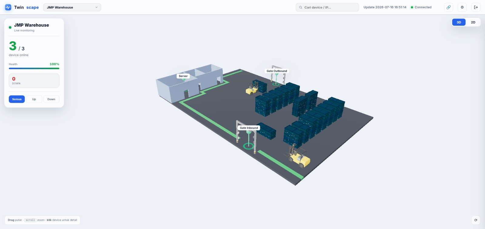
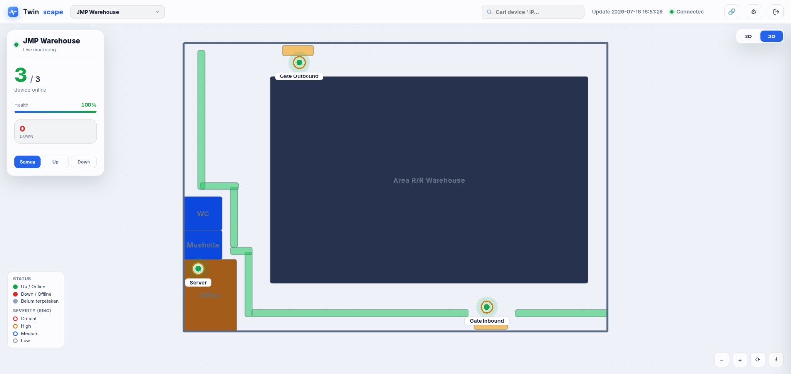

<div align="center">

# Twinscape

### A living 3D twin of your infrastructure.

Web app to **monitor _and_ operate** your hardware & servers through an interactive
**2D / 3D digital twin** — watch live device status on a map of your real facility, then
**SSH / VNC straight into a device** from the twin.



<sub>3D view — live device status on a digital twin of the real facility</sub>



<sub>2D floor-map view — the same live data, top-down</sub>

[](LICENSE)


</div>

---

## What is it?

Twinscape shows the hardware and servers you care about **live** — up, down, or silent —
rendered onto an interactive **3D digital twin** (and a matching **2D floor map**) built
from your real layout: rooms, racks, gates, machines. A device going down lights up exactly
where it physically is.

And it doesn't stop at watching: click a remotable device and **open an SSH terminal or a
VNC desktop right in the browser** — role-gated and audited. Twinscape is both the
**observability view** and the **operations console** for your infrastructure.

> **Remote access posture:** designed for trusted / internal networks (LAN or VPN). It ships
> with per-user roles (RBAC) + an audit log; add a front gate (VPN / Cloudflare Access / MFA)
> and SSH keys before exposing it beyond your LAN. See
> [`docs/ROADMAP-remote.md`](docs/ROADMAP-remote.md).

## Features

**Monitor**
- **Real-time status** — live device state via WebSocket, no page refresh.
- **2D / 3D visualization** — interactive digital twin of the real facility; orbit, zoom, click a device for details.
- **Multi-location / multi-floor** — switch between sites and floors, each with its own scene.
- **At a glance** — health score, up/down counts, down-timers, search, status filters, alerts (toast + optional sound).

**Operate (remote)**
- **In-browser SSH & VNC** — click a device → **SSH terminal** (xterm.js) or **VNC desktop** (noVNC), multi-tab, fullscreen/draggable. Optional auto-start (e.g. `x11vnc`) run over SSH first.
- **Role-based access (RBAC)** — per-user roles decide who can remote which device / group; **default-deny**.
- **Audit log** — every session (who · what device · when · duration) + denials recorded.
- **Credentials stay server-side** — targets & secrets (password or SSH key) live in server config, never sent to the browser.

**General**
- **Resilient client** — auto-reconnect with backoff, stale-data indicator, adaptive **graphics mode** (Auto/High/Lite) with FPS-based hint.
- **Bilingual UI** (English / Indonesia), light / dark theme, bahasa & theme togglable — settings in one menu.
- **Zero-build frontend** — vanilla JS + vendored Three.js / noVNC / xterm.js; **dependency-free auth** (Node `crypto`).

## Versions

Twinscape ships in two flavors that consume the same live data:

| | **Classic (v1)** | **Twinscape (v2)** ⭐ |
|---|---|---|
| View | Card grid | **Interactive 2D / 3D** |
| Best for | On-site local server | The main experience / showcase |
| Folder | `legacy/` | `twinscape/` |
| Port (default) | `10101` | `10102` |

**Twinscape (in [`twinscape/`](twinscape/)) is the flagship** — the 2D/3D twin is what
this project is about, and it's what `npm start` runs. The classic v1 card dashboard
lives in [`legacy/`](legacy/) for simple on-site local-server setups.

> A companion **Scene Builder** ([`builder/`](builder/), port `10103`) authors the 2D/3D
> scenes that Twinscape renders. It's part of Twinscape and will be folded in over time.

**Repo layout:**

```
twinscape/   ← ⭐ the flagship 2D/3D viewer + remote (npm start)
builder/     ← Scene Builder (authors 2D/3D scenes)
legacy/      ← classic v1 card dashboard + the headless Agent (agent.js)
docs/        ← deployment, performance & remote-access guides
```

## Architecture

Twinscape splits the **data source** from the **viewer** — one stable feed (`{devices}`) glues them:

- **Agent** — [`legacy/agent.js`](legacy/agent.js) (PM2 `twinscape-agent`): pings the devices on its network and emits a live `{devices}` feed over WebSocket. Headless, runs **per site**.
- **Viewer** — [`twinscape/`](twinscape/) (PM2 `twinscape`): consumes those feeds, renders the 2D/3D twin, and **bridges SSH/VNC** to devices (server-side, RBAC + audit).

```
[devices] ──ping──▶ Agent ──WS {devices}──▶ Viewer ──▶ browser (2D/3D + SSH/VNC)
```

- **Single box (all-in-one):** run both — `npm run up`.
- **Multi-site:** an **Agent per site** (reachable over VPN) + **one central Viewer** consuming them all.

## Installation

Requires **Node.js ≥ 16**.

```bash
git clone <repo-url> twinscape && cd twinscape
npm install
```

## Usage

```bash
# Twinscape viewer — the 2D/3D digital twin + remote (flagship)
npm start             # → http://localhost:10102

# Agent — pings devices + emits the WS feed the viewer consumes (per site)
npm run agent

# Scene Builder — author 2D/3D scenes for Twinscape
npm run builder       # → http://localhost:10103

# Classic card dashboard (v1, optional)
npm run classic       # → http://localhost:10101
```

Twinscape is login-gated. Create an account (a `--role` sets RBAC access):

```bash
node twinscape/adduser.js <username> <password> --role admin
```

**Production (PM2):**

```bash
npm run up            # start BOTH viewer + agent (all-in-one box)
# or split for multi-site:
pm2 start ecosystem.config.js --only twinscape         # central viewer
pm2 start ecosystem.config.js --only twinscape-agent   # each site
```

See [`docs/`](docs/) for deployment guides — running the server, Cloudflare Tunnel, and the [remote-access roadmap](docs/ROADMAP-remote.md).

## Configuration

Local config files hold internal hosts/credentials, so they're **gitignored** — copy the
matching `*.example` and fill in:

- **Locations / feeds** — `twinscape/locations.json` (← `locations.example.json`): each location points at an Agent's WebSocket (`"ws": "ws://<host>:<port>/ws"`) + its 2D/3D scene files (+ optional `floors`).
- **Remote targets + RBAC** — `twinscape/remotes.json` (← `remotes.example.json`): per-device SSH/VNC `host`/`port`/`username` + credential (`password` or `keyFile`), device `group`, and `roles`. Turn remote on with `REMOTE_ENABLE=1` in `.env`.
- **Env** — `twinscape/.env` (← `.env.example`): `REMOTE_ENABLE` (remote master switch), optional `V2_PORT` / `V2_HOST` / `PULSE_SECRET`.
- **Agent** — `legacy/config.json` + `legacy/data/devices.json`: the device list the Agent pings, ping interval, ports.
- **Scenes** — authored in the Scene Builder, saved as JSON under `twinscape/public/assets/`.
- **Accounts** — `node twinscape/adduser.js <user> <pass> --role <admin|operator|viewer>` (stored hashed in `twinscape/users.json`).

## Tech Stack

- **Backend** — Node.js, [Express](https://expressjs.com/), [`ws`](https://github.com/websockets/ws) (WebSocket), [`ping`](https://www.npmjs.com/package/ping).
- **3D** — [Three.js](https://threejs.org/) (vendored, offline via import-map). **2D** — hand-rolled SVG floor maps.
- **Remote** — [`ssh2`](https://github.com/mscdex/ssh2) (SSH bridge), [noVNC](https://novnc.com/) over a raw WS↔TCP pipe (VNC), [xterm.js](https://xtermjs.org/) terminal — all vendored offline.
- **Frontend** — vanilla JavaScript, no build step.
- **Auth** — dependency-free: Node `crypto` (scrypt password hash + HMAC-signed cookie session) + RBAC.
- **Ops** — PM2 (viewer + agent); Cloudflare Tunnel / VPN for access.

## License

[MIT](LICENSE) © Rifky Andigta Al-Fathir

<sub>Originally built for hardware ops at Stechoq.</sub>
